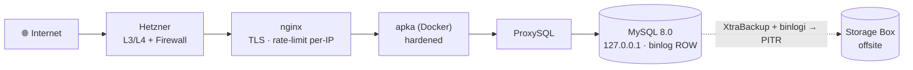

# mysql-hetzner-lab

Samozarządzany **MySQL 8.0 na jednym serwerze Hetzner Cloud**, w pełni IaC: **Terraform** (infra) + **Ansible** (config).
Cel: postawić bazę od zera, **dobrze zabezpieczyć publiczną aplikację** przed nią, mieć **przetestowany backup +
restore + point-in-time recovery**, i prostą aplikację w Dockerze (insert→delete = żywy smoke-test bazy).
Repo **portfolio/nauka** — nie produkt.

## Nawigacja
- **Jak pracujemy** (operating manual): [CLAUDE.md](CLAUDE.md)
- **Co robimy / status** (board, fazy, DoD): [TASKS.md](TASKS.md)
- **Jak to działa / dlaczego** (wiedza): [docs/](docs/README.md)
  - architektura · bezpieczeństwo/DDoS · backup-and-recovery · observability · CI/CD · ADR-y

## Architektura w skrócie
Aplikacja **publiczna** (80/443) za reverse-proxy **nginx** (TLS, rate-limit, timeouty); **MySQL prywatny**
(`127.0.0.1`, przez ProxySQL); SSH publiczny, utwardzony (key-only + fail2ban). Obrona DDoS warstwowo: sieć Hetznera
(wolumetryka, auto) + `nftables`/`fail2ban`/rate-limit + izolacja zasobów apka⟂baza. **Bez CDN/VPN — świadomie**
([ADR-0005](docs/decisions/0005-ekspozycja-publiczna.md)). Pełny obraz: [docs/explanation/architecture.md](docs/explanation/architecture.md).

## Stack
Terraform (`hcloud`) · Ansible (role hardening/mysql/proxysql/backup/nginx/docker-app) · MySQL 8.0 + binlog · ProxySQL ·
Percona XtraBackup + binlogi (PITR) · Hetzner Storage Box (offsite) · Prometheus/Grafana/Loki (on-box) · GitHub Actions.

## Reuse
Część ról (hardening, observability, backup-orkiestracja, configi) adaptujemy z bliźniaczego repo KontrahentCheck —
mapa: [docs/reuse-from-kontrahentcheck.md](docs/reuse-from-kontrahentcheck.md).

## Status
Wczesny bootstrap (Faza 0 — scaffolding). Roadmapa i bramki: [TASKS.md](TASKS.md). Koszt docelowy ~€5-8/mc.
