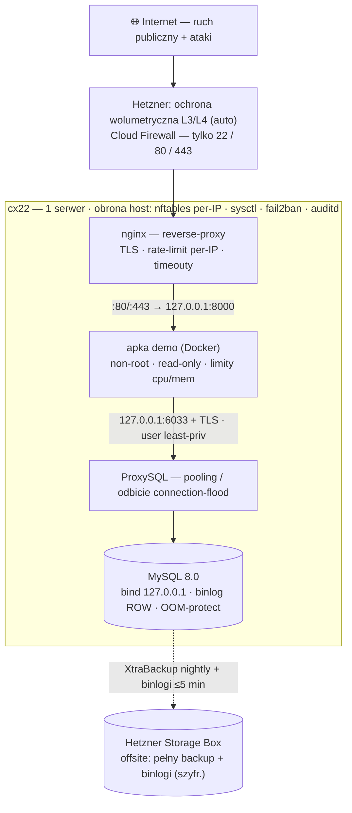

# Architektura — mysql-hetzner-lab

Samozarządzany MySQL 8.0 na **jednym** serwerze Hetzner Cloud. **Terraform = infra, Ansible = config.**
Decyzje: [ADR-0001](../decisions/0001-provisioning-terraform-ansible.md), [ADR-0003](../decisions/0003-topologia-1-serwer.md).

## Topologia: 1 serwer (cx22)
MySQL + apka demo (Docker) na jednej maszynie. **MySQL słucha tylko na `127.0.0.1`** (apka łączy się przez ProxySQL po
localhost). **Aplikacja jest PUBLICZNA** (80/443) za reverse-proxy **nginx** (TLS przez certbot (Let's Encrypt) + rate-limit + timeouty);
**SSH publiczny, utwardzony** (key-only + fail2ban). **Bez CDN i bez VPN** — obrona DDoS jest host/proxy-level + automatyczna
sieciowa Hetznera ([security.md](security.md), [ADR-0005](../decisions/0005-ekspozycja-publiczna.md)).

## Diagram (aplikacja publiczna, baza prywatna)

## Komponenty
- **Terraform (infra):** `hcloud_server` cx22 (Ubuntu 24.04), `hcloud_ssh_key`, `hcloud_volume` (`/var/lib/mysql`,
  `prevent_destroy`), Storage Box, `hcloud_firewall`. Backend stanu poza repo; outputy `sensitive=true`.
- **Ansible (config):** role `os-hardening`, `nginx`, `mysql`, `proxysql`, `backup`, `docker-app`. Idempotentne.
- **nginx (reverse-proxy):** publiczny front 80/443, TLS przez certbot (Let's Encrypt), rate-limit + timeouty (anti-slowloris/flood) — **własna rola** (KC używał Caddy; nginx wybrany jako bardziej znany).
- **MySQL 8.0:** bind `127.0.0.1`, `binlog_format=ROW`, TLS, user apki least-priv z limitami per-user.
- **ProxySQL:** między apką a MySQL — pooling połączeń i miękkie odbicie connection-flood (apka łączy się do ProxySQL, nie wprost).
- **Monitoring (on-box):** Prometheus+Grafana+Loki+Alertmanager + exportery ([observability.md](observability.md),
  [ADR-0006](../decisions/0006-monitoring-stack.md)); dead-man's-switch **zewnętrzny** (healthchecks.io).
- **Apka demo:** kontener insert→delete = żywy smoke-test + **sonda SLI** (eksport latency/sukces) — [TASKS Faza 7](../../TASKS.md).
- **Offsite:** Hetzner Storage Box — pełny backup + binlogi, szyfrowane ([backup-and-recovery.md](backup-and-recovery.md)).

## Granica TF / Ansible
Terraform tworzy zasoby chmury (VM/firewall/storage). Ansible konfiguruje wszystko **na** maszynie. Bez mieszania —
żadnych providerów konfiguracyjnych w TF, żadnego stawiania VM z Ansible. To upraszcza `plan/diff` i blast-radius.

## Koszt
~€5-8/mc (cx22 + Storage Box BX11). GitHub Actions / Let's Encrypt — darmowe. **Bez CDN** (świadomie, [ADR-0005](../decisions/0005-ekspozycja-publiczna.md)) — origin publiczny.
**Uwaga RAM:** self-hosted monitoring + MySQL + ProxySQL na 4 GB to ciasno — rozważ **cx32 (8 GB, ~€11-13/mc)** lub lekki
stack (VictoriaMetrics, krótka retencja). Do potwierdzenia ([ADR-0006](../decisions/0006-monitoring-stack.md)).
SPOF (1 serwer) akceptowany świadomie — uzasadnienie i granice w [ADR-0003](../decisions/0003-topologia-1-serwer.md).
